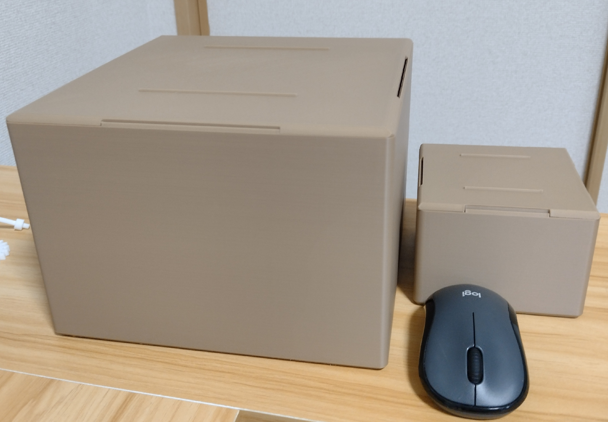
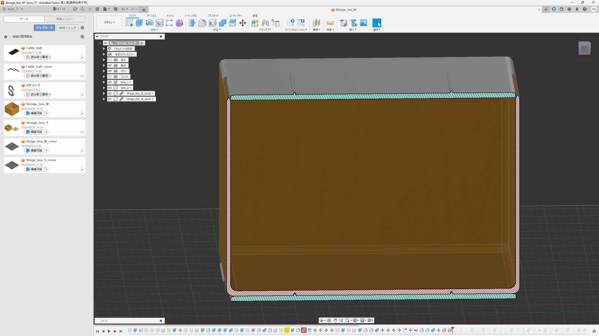
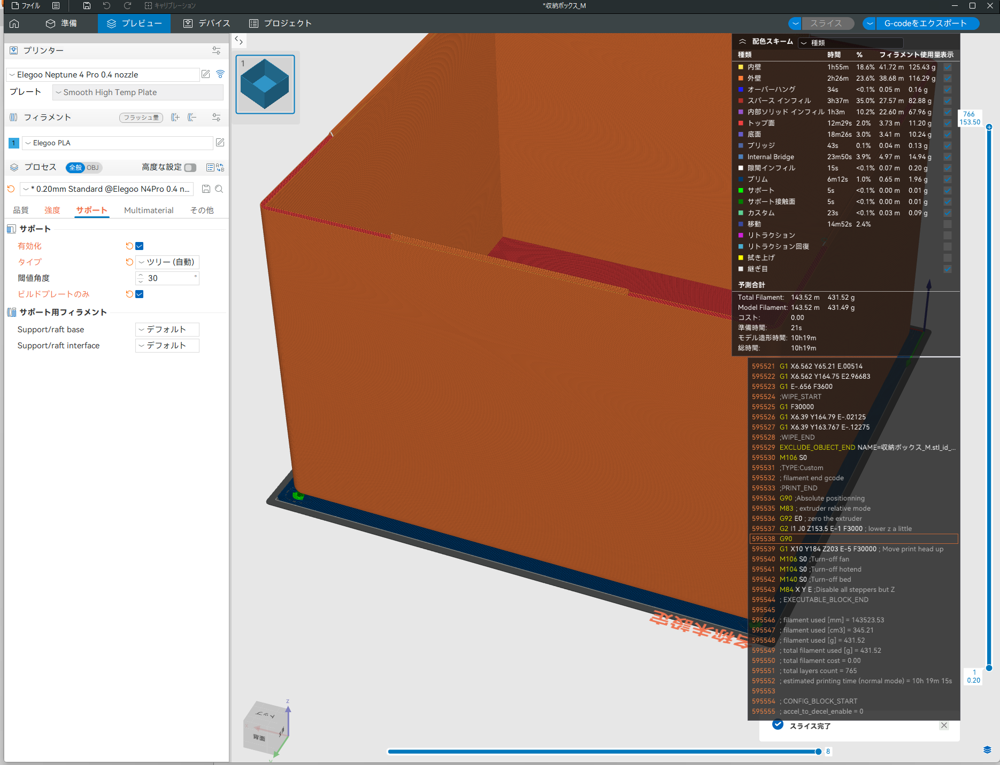
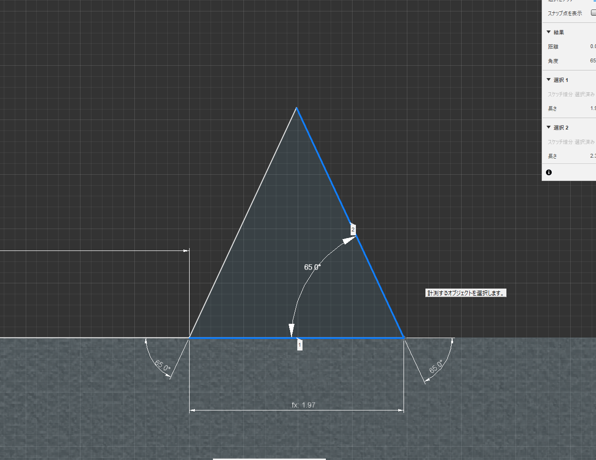
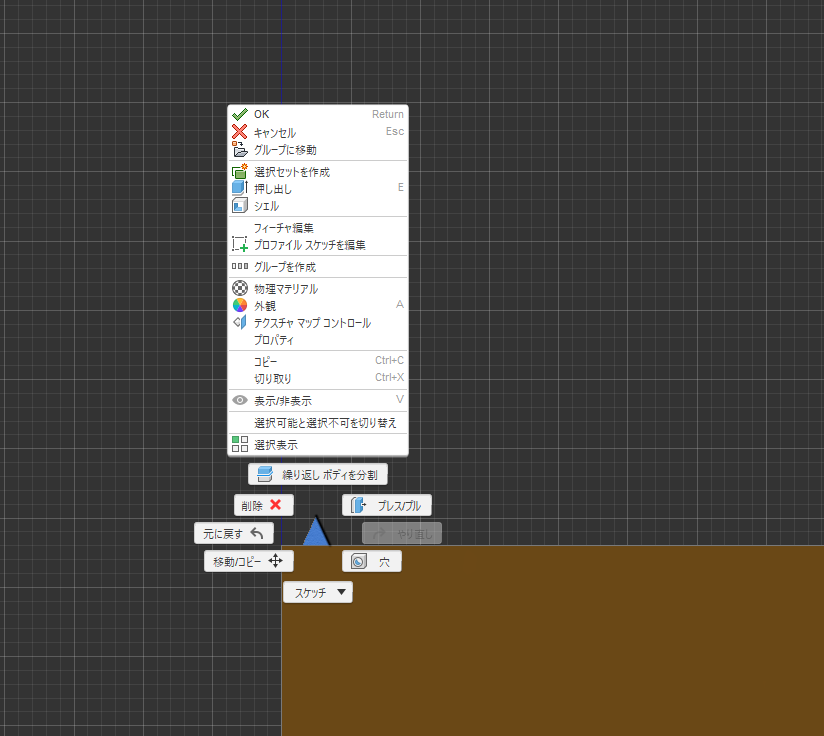

# 📦 3Dプリント収納ボックス

[](https://opensource.org/licenses/MIT)
[](https://www.elegoo.com/products/elegoo-neptune-4-pro-3d-printer)
[](https://claude.ai)
[](https://www.autodesk.com/products/fusion-360)

> 🎯 **学習目標**: 3Dプリンターと3DCADの実践的スキル習得  
> 🏠 **実用性**: 実際に部屋の整理に活用  
> 🚀 **技術向上**: 設計から製造まで一貫したプロジェクト  
> 📦 **生活改善**: 部屋の整理整頓も同時に実現

**シンプルで実用的な3Dプリント製収納ボックス** - 3DプリンターとFusion 360の学習を兼ねて制作した、スタッキング可能な収納システム。技術習得と部屋の整理を同時に達成！



## 🎯 プロジェクト概要

### 📚 学習目的
このプロジェクトは、**3Dプリンターと3DCADの実践的スキル習得**を目的として企画されました。理論だけでなく、実際に使える製品を作ることで、設計から製造までの一連のプロセスを体験的に学ぶことができました。さらに、**部屋の整理整頓も同時に実現**し、学習と生活改善の両方を達成しました。

### 🎨 プロジェクトの特徴
- **実践的学習**: 3DプリンターとFusion 360の基本から応用まで
- **実用性重視**: 実際に部屋の整理に使用できる製品
- **生活改善**: 部屋の整理整頓を同時に実現
- **シンプル設計**: 市販品よりシンプルで使いやすい構造
- **印刷最適化**: 印刷しやすさを重視した設計
- **スケーラブル設計**: 複数サイズへの展開が容易

### 🛠️ 技術スタック
| 技術・ツール | 用途 | 学習内容 |
|-------------|------|----------|
| **Fusion 360** | 3DCAD設計 | パラメトリック設計、アセンブリ、製造性考慮 |
| **Neptune 4 Pro** | 3Dプリント | スライサー設定、印刷パラメータ最適化 |
| **PLA材料** | 印刷材料 | 材料特性、印刷条件の理解 |
| **Claude 4** | AIアシスタント | 設計相談、問題解決支援 |

## 📐 設計仕様

| 項目 | Mサイズ | Sサイズ |
|------|---------|---------|
| **外寸** | 220×220×155mm | 110×110×77.5mm |
| **内寸** | 214×214×148mm | 107×107×74mm |
| **壁厚** | 3.0mm(底面4.0mm) | 3.0mm(底面4.0mm) |
| **容量** | 約6.7L | 約0.8L |
| **重量** | 約450g | 約120g |

### 🖨️ 印刷設定
```yaml
材料: PLA
ノズル温度: 210°C
ベッド温度: 60°C
層厚: 0.2mm
インフィル: 20% (ジャイロイド)
サポート: 底面のみ少量
印刷時間: Mサイズ約15時間 / Sサイズ約4時間
```

## 🛠️ 設計プロセス

### 🎯 設計コンセプト
- ✅ **スタッキング機能**: 市販品のような積み重ねやすさ
- ✅ **シンプルなはめ合わせ**: 接着剤不要の簡単な組み立て
- ✅ **印刷最適化**: サポート材最小化と印刷しやすさを重視
- ✅ **拡張性**: パラメトリック設計によるサイズ展開

### 🔧 技術的工夫
1. **スタッキング機構**: 三角突起と切り欠きによる安定した積み重ね
2. **オーバーハング考慮**: 45度以下の角度でサポート材不要
3. **はめ合わせ設計**: 0.3mmの適切なクリアランスで簡単な組み立て
4. **印刷最適化**: 市販品よりシンプルで印刷しやすい構造
5. **パラメトリック設計**: サイズ変更が容易な構造






## 📊 学習成果

### 🎓 技術的スキル
- **3DCAD設計**: Fusion 360の基本操作からパラメトリック設計まで
- **3Dプリント**: スライサー設定、印刷パラメータの最適化
- **製造性設計**: 3Dプリントに適した設計手法
- **品質管理**: 寸法精度、表面品質の評価方法

### 📈 実践的成果
- **設計効率**: パラメトリック設計による迅速なサイズ変更
- **製造効率**: サポートレス設計による材料・時間節約
- **品質向上**: 設計段階での製造性考慮による完成度向上

### 🏆 品質評価
- ✅ **寸法精度**: ±0.3mm以内（設計目標達成）
- ✅ **表面品質**: 良好（表面仕上げ不要）
- ✅ **はめ合わせ精度**: 調整不要の完璧なフィット
- ✅ **実用性**: 3ヶ月使用で問題なし

## 🎯 学習のポイント

### 📚 3DCAD学習
- **パラメトリック設計**: 寸法変更が容易な設計手法
- **アセンブリ設計**: 複数パーツの組み合わせ考慮
- **製造性考慮**: 3Dプリントに適した形状設計
- **ファイル管理**: 設計履歴とバージョン管理

### 🖨️ 3Dプリント学習
- **スライサー設定**: 印刷パラメータの最適化
- **材料特性**: PLAの特性と印刷条件
- **印刷方向**: 強度と品質への影響
- **印刷最適化**: サポート材最小化と印刷しやすさの追求

## 📁 ファイル構成

```
📁 CAD-Files/
├── Storage_box_M.f3d           # Mサイズボックス設計（Fusion 360）
├── Strage_box_M_cover.f3d      # Mサイズ蓋部分設計  
├── Storage_box_S.f3z           # Sサイズボックス設計
├── Storage_box_M.step          # Mサイズボックス（汎用フォーマット）
├── Strage_box_M_cover.step     # Mサイズ蓋（汎用フォーマット）
├── Storage_box_S.step          # Sサイズボックス（汎用フォーマット）
├── Storage_box_M.stl           # Mサイズボックス（プリント用）
├── Strage_box_M_cover.stl      # Mサイズ蓋（プリント用）
└── Storage_box_S.stl           # Sサイズボックス（プリント用）

📁 Documentation/
├── design-process.md           # 詳細な設計プロセス
└── print-settings.md           # 印刷設定詳細
```

## 🎓 学んだこと

**設計面**:
- 3Dプリント初学のため、学習兼部屋の整理、パラメトリック設計のやり方を学んだ
- 市販品よりシンプルで使いやすく、印刷しやすい構造を目指した設計
- オーバーハング考慮した設計、切り欠きを三角の形状にしサポート材を節約
- はめ合わせ部はクリアランス0.3mmできつすぎずゆるすぎないフィット感を実現

**製造面**:
- プリント方向による品質差の理解
- 材料特性の実践的理解
- 印刷最適化による表面仕上げ不要の設計

### 📚 学習継続
- **高度な設計**: アセンブリの複雑化
- **製造技術**: 異なる3Dプリント技術の習得
- **品質向上**: より高精度な印刷技術の習得

## 📄 ライセンス

このプロジェクトは [MIT License](LICENSE) の下で公開されています。  
商用・非商用問わず自由にご利用ください。

## 🔗 関連リンク

- [個人ポートフォリオ](https://github.com/tomomo086)

---

**作成者**: [tomomo086(@mirai_sousiyo39)+Claude4]   
**最終更新**: 2025年7月1日

> 💡 **このプロジェクトを通じて、3Dプリンターと3DCADの実践的スキルを習得し、実際に使える製品を作る楽しさを体験しました。さらに、部屋の整理整頓も同時に実現し、技術習得と生活改善の両方を達成できました。**
