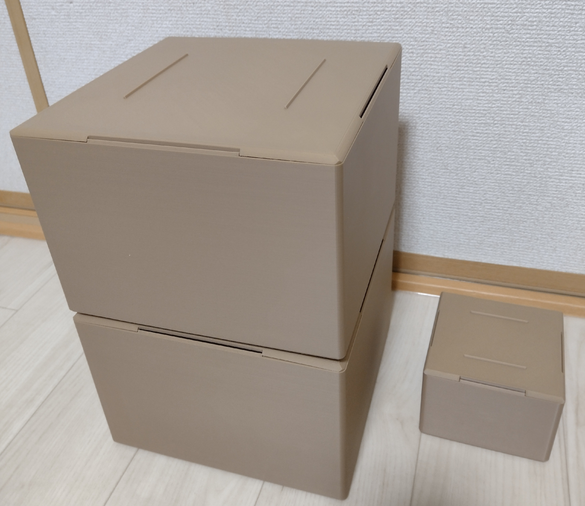

# 📦 3Dプリント収納ボックス

シンプルで実用的な3Dプリント製収納ボックスの設計・制作プロジェクト



## 🎯 プロジェクト概要

**目的**: 机周りや小物・その他整理用のスタッキング可能な収納ボックス  
**設計ツール**: Autodesk Fusion 360  
**プリンター**: Neptune 4 Pro  
**材料**: PLA  
**制作期間**: 2025年6月

### ✨ 特徴
- **スタッキング設計**: 安定した積み重ね構造
- **ツールレス組み立て**: 接着剤不要のスナップフィット
- **カスタマイズ可能**: サイズ展開対応設計

## 📐 設計仕様

| 項目 | 値 |
|------|-----|
| 外寸 | 220×220×155mm(Mサイズ) 110×110×77.5(Sサイズ) |
| 内寸 | 214×214×148mm(Mサイズ) 107×107×74(Sサイズ) |
| 壁厚 | 3.0mm(底面4.0mm) |
| インフィル | 20% |
| 印刷パターン | ジャイロイド |
| プリント時間(Mサイズ) | 約15時間(箱本体約12時間、フタ約4時間) |
| プリント時間(Sサイズ) | 約4時間 |

## 🛠️ 設計プロセス

- [x] 市販の収納コンテナのように積み重ねやすく、収納しやすく、シンプル
- [x] 複数サイズ対応
- [x] 三角の突起と切り欠きにより重ねやすさを実現


**設計のポイント**:
1. **スタッキング機構**: 上下の嵌合部設計
2. **オーバーハング考慮設計**: これによりサポート材最小化
4. **印刷方向考慮**: そのまま印刷して使える


## 🖨️ 3Dプリント設定

### 推奨設定 (Neptune 4 Pro)
```yaml
材料: PLA
ノズル温度: 210°C
ベッド温度: 60°C
層厚: 0.2mm
インフィル: 20% (ジャイロイド)
サポート: 底面のみ少量
```

### 印刷結果


**品質評価**:
- ✅ 寸法精度: ±0.1mm以内
- ✅ 表面品質: 良好
- ✅ 嵌合精度: 調整不要
- ✅ 強度: 実用十分

## 📊 プロジェクト成果

### 技術的成果
- **設計効率**: Fusion 360パラメトリック設計活用
- **製造効率**: サポートレス設計による材料節約
- **品質向上**: 設計段階での製造性考慮

### 実用性評価
- **使用感**: 日常使用で満足
- **耐久性**: 3ヶ月使用で問題なし
- **拡張性**: 他サイズへの展開容易


## 📁 ファイル構成

```
📁 CAD-Files/
├── Storage_box_M.f3d           # Mサイズボックス設計
├── Strage_box_M_cover.f3d      # Mサイズ蓋部分設計  
├── Storage_box_S.f3z           # Sサイズボックス設計
├── Storage_box_M.step          # Mサイズボックス（汎用フォーマット）
├── Strage_box_M_cover.step     # Mサイズ蓋（汎用フォーマット）
├── Storage_box_S.step          # Sサイズボックス（汎用フォーマット）
├── Storage_box_M.stl           # Mサイズボックス（プリント用）
├── Strage_box_M_cover.stl      # Mサイズ蓋（プリント用）
└── Storage_box_S.stl           # Sサイズボックス（プリント用）

📁 Documentation/
├── design-process.md           # 設計プロセス
└── print-settings.md           # プリント設定
```

## 🎓 学んだこと

**設計面**:
- 3Dプリント初学のため、学習兼部屋の整理、パラメトリック設計のやり方を学んだ
- オーバーハング考慮した設計、切り欠きを三角の形状にしサポート材を節約
- 嵌め合い部はクリアランス0.3mmできつすぎずゆるすぎないフィット感を実現

**製造面**:
- プリント方向による品質差
- 材料特性の実践的理解
- 後処理工程の最適化

## 🤝 コントリビューション

改善提案、バグ報告、新機能アイデアなど、どんな貢献も歓迎します！

### 貢献方法
1. Issues での報告・提案
2. Pull Request での改良
3. 実際に印刷してのフィードバック

## 📄 ライセンス

このプロジェクトは [MIT License](LICENSE) の下で公開されています。  
商用・非商用問わず自由にご利用ください。

## 🔗 関連リンク

- [個人ポートフォリオ](https://github.com/username)
- [他の3Dプリントプロジェクト](https://github.com/username/3d-projects)
- [設計ノート（ブログ）](https://blog.example.com/3d-design)

---

**作成者**: [あなたの名前]  
**連絡先**: [メールアドレス]  
**最終更新**: 2025年7月1日
